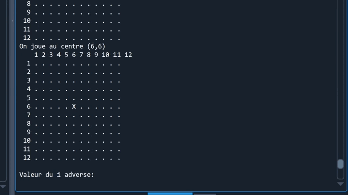

<h1 align="center">
  
</h1>

---

# Affrontement entre IA pour le jeu de Morpion 4

## Petit résumé

- Le but du jeu est d’aligner une suite de 4 pions sur une grille comptant 12 colonnes et 12 lignes.
Le vainqueur est le joueur qui réalise le premier un alignement (horizontal, vertical ou diagonal)
cons´ecutif d’au moins quatre de ses pions. Si, alors que toutes les cases de la grille de jeu sont
remplies, aucun des deux joueurs n’a réalisé un tel alignement, la partie est d´eclarée nulle.

## Objectifs

- Réaliser une IA capable de jouer au morpion 4

## Techno

- Python
- Spyder

## API

## Auteur

- [@Anthony](https://github.com/Cyd-des-Tenebres)
- [@Tom](https://github.com/Flaye)
- [@Pierre](https://github.com/Pierre-Portfolio)