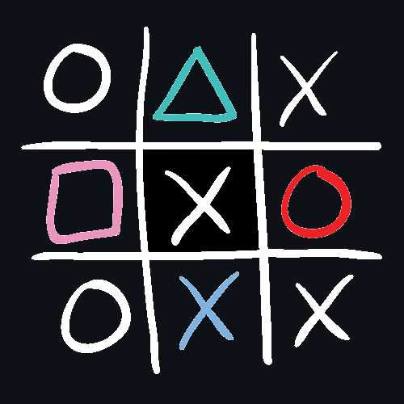

<h1 align="center">
  
</h1>

---

# Affrontement entre IA pour le jeu du Morpion 4

## Petit résumé

- Le but du jeu consiste à aligner 4 pions sur une grille 12x12. Le vainqueur est le joueur qui réalisera le premier un alignement (horizontal, vertical ou diagonal) sur cette grille. Si, alors que toutes les cases de la grille de jeu sont remplies, et qu'aucun des deux joueurs n'a réalisé un tel alignement, la partie est déclarée est nulle.

## Objectifs

- Réaliser une IA capable de jouer au morpion 4

## Techno

- Python
- Spyder

## UI

## Auteur

- [@Anthony](https://github.com/Cyd-des-Tenebres)
- [@Tom](https://github.com/Flaye)
- [@Pierre](https://github.com/Pierre-Portfolio)